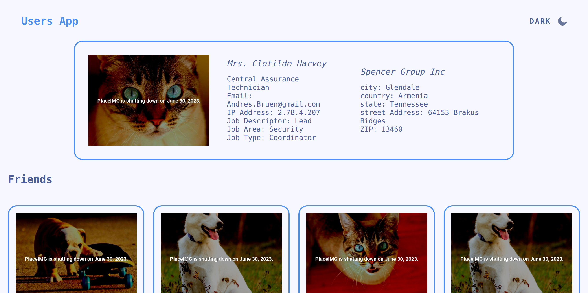

# Users Profiles App

## Table of contents

- [Overview](#overview)
  - [The challenge](#the-challenge)
  - [Screenshot](#screenshot)
  - [Links](#links)
- [My process](#my-process)
  - [Built with](#built-with)
- [Author](#author)

## Overview

### The challenge

Users should be able to:

- Switch between light and dark themes
- To see users' cards on the Homepage
- To scroll infinitely (loads content continuously as the user scrolls down)
- Click on a user card (programmatically scrolls on the user at the top) and see his/her information

### Screenshot

### Links

- Solution URL: [GitHub](https://github.com/Giorgi-Jalali/users-profiles-app)

- Live Site URL: [Vercel](https://users-profiles-app-gjalali.vercel.app/)

## My process

### Built with

- [React](https://reactjs.org/) - JS library
- [Redux/Toolkit](https://redux-toolkit.js.org/) - For state management
- [React Router](https://reactrouter.com/en/main) - For pages
- [Styled Components](https://styled-components.com/) - For styles
- [Axios](https://axios-http.com/docs/intro) - For HTTP requests
- [SweeftDigital API](http://sweeftdigital-intern.eu-central-1.elasticbeanstalk.com/swagger/) - For getting users
- [Loader Spinner](https://www.npmjs.com/package/react-spinners) - For loader

## Author

- LinkedIn - [Giorgi Jalali](https://www.linkedin.com/in/giorgi-jalali-0336b8225/)
